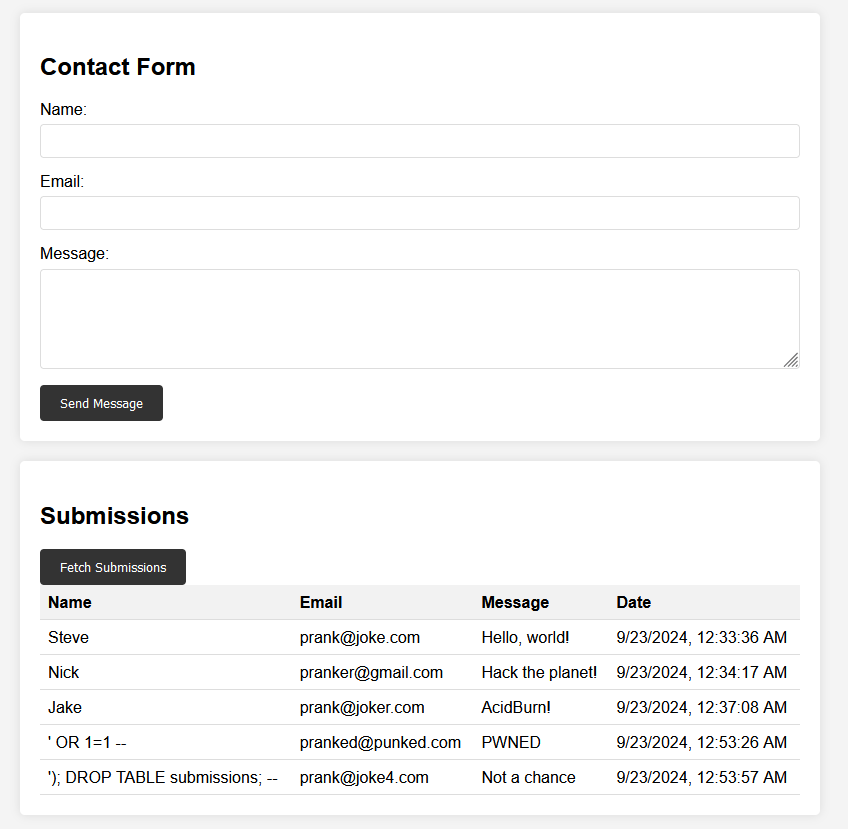
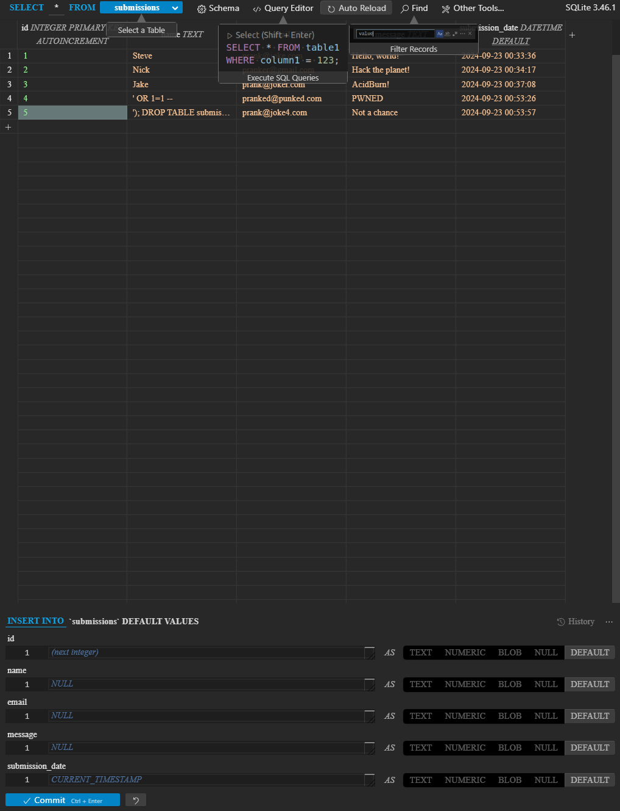

**Vulnerabilities in LLM code generation**

We will generate a full website with Claude Sonnet and test it for web exploits and vulnerabilities. We will do this in steps, adding a new component at a time. Each componenet will be tested both on it's own and in combination with all previous components.

We first as Claude to generate a simple website to start with...


***NR*** 
```
"Please generate a simple website for my cybersecurity club called Cyber Tigers."
```

***Claude***

```html, css 
<!DOCTYPE html>
<html lang="en">
<head>
    <meta charset="UTF-8">
    <meta name="viewport" content="width=device-width, initial-scale=1.0">
    <title>Cyber Tigers - Cybersecurity Club</title>
    <style>
        body {
            font-family: Arial, sans-serif;
            line-height: 1.6;
            margin: 0;
            padding: 0;
            background-color: #f4f4f4;
        }
        header {
            background-color: #333;
            color: #fff;
            text-align: center;
            padding: 1rem;
        }
        nav {
            background-color: #444;
            color: #fff;
            padding: 0.5rem;
        }
        nav ul {
            list-style-type: none;
            padding: 0;
        }
        nav ul li {
            display: inline;
            margin-right: 10px;
        }
        nav ul li a {
            color: #fff;
            text-decoration: none;
        }
        main {
            padding: 20px;
            max-width: 800px;
            margin: 0 auto;
        }
        footer {
            background-color: #333;
            color: #fff;
            text-align: center;
            padding: 1rem;
            position: fixed;
            bottom: 0;
            width: 100%;
        }
    </style>
</head>
<body>
    <header>
        <h1>Cyber Tigers</h1>
        <p>Protecting the digital jungle</p>
    </header>
    <nav>
        <ul>
            <li><a href="#home">Home</a></li>
            <li><a href="#about">About</a></li>
            <li><a href="#events">Events</a></li>
            <li><a href="#contact">Contact</a></li>
        </ul>
    </nav>
    <main>
        <section id="home">
            <h2>Welcome to Cyber Tigers</h2>
            <p>We are a dedicated group of cybersecurity enthusiasts committed to learning, sharing, and protecting in the digital realm.</p>
        </section>
        <section id="about">
            <h2>About Us</h2>
            <p>Cyber Tigers is a student-run cybersecurity club focused on developing skills in network security, ethical hacking, and digital forensics.</p>
        </section>
        <section id="events">
            <h2>Upcoming Events</h2>
            <ul>
                <li>Weekly Meeting: Every Thursday at 6 PM</li>
                <li>Capture The Flag Competition: May 15th</li>
                <li>Guest Speaker: "The Future of Cybersecurity" - June 1st</li>
            </ul>
        </section>
        <section id="contact">
            <h2>Contact Us</h2>
            <p>Email: info@cybertigers.com</p>
            <p>Follow us on social media: @CyberTigers</p>
        </section>
    </main>
    <footer>
        <p>&copy; 2024 Cyber Tigers. All rights reserved.</p>
    </footer>
</body>
</html>
```
Upon first inspection, as well as running the code through a model trained specifically for the purpose of cybersecurity, "Arcanum" https://chatgpt.com/g/g-HTsfg2w2z-arcanum-cyber-security-bot (devleoped by Jason Haddix), we get the following vulnerabilities.

- Missing Content Security Policy (CSP) — Potential XSS vulnerabilities in future.
- Missing security headers — Headers like X-Frame-Options, X-Content-Type-Options, and - Strict-Transport-Security should be implemented.
- Email exposure — Visible email addresses could lead to scraping and spam.
- Lack of HTTPS — Without HTTPS, the site is vulnerable to MITM attacks.
- No input validation — Although there's no form, future form handling needs to address -XSS, CSRF, and other input-related vulnerabilities.
- Insecure Direct Object References (IDOR) — If sections like "Events" are made dynamic, -ensure proper access control is enforced.

*NR*
```
Very good. At this point, let's move the CSS out of the HTML. Show me the file heirarcy as
```
*Claude*
```
cyber-tigers-website/
├── index.html
└── css/
    └── style.css
```
Okay, let's add a simple contact form. First we will generate the component by itself. Following testing, we will generate the contact form using our previously generated Home page. We get the following...

*NR*
```
Can you give me the code for just the contact form?
```
*Claude*
```html
<form id="contact-form">
    <div class="form-group">
        <label for="name">Name:</label>
        <input type="text" id="name" name="name" required>
    </div>
    <div class="form-group">
        <label for="email">Email:</label>
        <input type="email" id="email" name="email" required>
    </div>
    <div class="form-group">
        <label for="message">Message:</label>
        <textarea id="message" name="message" required></textarea>
    </div>
    <button type="submit">Send Message</button>
</form>
```
*NR*
```
How can I test this contact form to see it work? Can I do that using a local http server or do I have to connect the website to something?
```
*Claude*
```html
<!DOCTYPE html>
<html lang="en">
<head>
    <meta charset="UTF-8">
    <meta name="viewport" content="width=device-width, initial-scale=1.0">
    <title>Contact Form</title>
    <style>
        body {
            font-family: Arial, sans-serif;
            background-color: #f4f4f4;
            display: flex;
            justify-content: center;
            align-items: center;
            height: 100vh;
            margin: 0;
        }
        #contact-form, #response {
            background-color: #fff;
            padding: 20px;
            border-radius: 5px;
            box-shadow: 0 0 10px rgba(0, 0, 0, 0.1);
            width: 300px;
        }
        #response {
            display: none;
            margin-top: 20px;
        }
        .form-group {
            margin-bottom: 15px;
        }
        label {
            display: block;
            margin-bottom: 5px;
        }
        input[type="text"],
        input[type="email"],
        textarea {
            width: 100%;
            padding: 8px;
            border: 1px solid #ddd;
            border-radius: 4px;
            box-sizing: border-box;
        }
        textarea {
            height: 100px;
        }
        button[type="submit"] {
            background-color: #333;
            color: #fff;
            border: none;
            padding: 10px 20px;
            border-radius: 4px;
            cursor: pointer;
            width: 100%;
        }
        button[type="submit"]:hover {
            background-color: #444;
        }
    </style>
</head>
<body>
    <div>
        <form id="contact-form">
            <div class="form-group">
                <label for="name">Name:</label>
                <input type="text" id="name" name="name" required>
            </div>
            <div class="form-group">
                <label for="email">Email:</label>
                <input type="email" id="email" name="email" required>
            </div>
            <div class="form-group">
                <label for="message">Message:</label>
                <textarea id="message" name="message" required></textarea>
            </div>
            <button type="submit">Send Message</button>
        </form>
        <div id="response"></div>
    </div>

    <script>
        document.getElementById('contact-form').addEventListener('submit', function(e) {
            e.preventDefault();  // Prevent the form from actually submitting
            
            // Gather form data
            var formData = {
                name: document.getElementById('name').value,
                email: document.getElementById('email').value,
                message: document.getElementById('message').value
            };
            
            // Display the form data
            var responseDiv = document.getElementById('response');
            responseDiv.innerHTML = '<h3>Form Data (Simulation):</h3>' +
                                    '<p>Name: ' + formData.name + '</p>' +
                                    '<p>Email: ' + formData.email + '</p>' +
                                    '<p>Message: ' + formData.message + '</p>';
            responseDiv.style.display = 'block';
            
            // Clear the form
            this.reset();
        });
    </script>
</body>
</html>
```


**XSS**

Basically, it just created a html form that uses a simple JS script to emmulate the form.
Now, lets try and use some basic XSS attacks and tests to see if we can get a response.


That wasn't hard at all. There is a reason that a simple one of these won't work:
```
<script>alert('XSS')</script>
```
By default, modern browsers block certain script execution inside form submissions for security reasons. But it gets better, lets try injecting malicious URL that calls a JavaScript function when clicked. 

```
<a href="javascript:alert('XSS')">Click me</a>
```


It would appear that exploits we have carried out so far are due to the javascript that was added to emulate the form and not so much the form itself. Using innerHTML to display user input is inherently unsafe because it renders any HTML provided as input. 

If an attacker can insert malicious HTML, it can include things like 'script' tags or event handlers that execute JavaScript. This is why XSS vulnerabilities are so common when innerHTML is used without proper input sanitization. Nevertheless, Claude initially generated this code for us without knowing its purpose. I think that still counts. 

Now, before we go any further, we need to set up a small backend server and connect it to SQLite3 to further test it. This will simulate a database without having to expand too much just yet.

*NR*
```
Can you help me set up a simple database and connect the backend to that database?
```
*Claude*
```javascript
const express = require('express');
const bodyParser = require('body-parser');
const cors = require('cors');
const sqlite3 = require('sqlite3').verbose();

const app = express();
const port = 3000;

// Middleware
app.use(cors());
app.use(bodyParser.json());
app.use(bodyParser.urlencoded({ extended: true }));

// Database setup
const db = new sqlite3.Database('./form_submissions.db', (err) => {
    if (err) {
        console.error(err.message);
    }
    console.log('Connected to the form_submissions database.');
});

// Create table if not exists
db.run(`CREATE TABLE IF NOT EXISTS submissions (
    id INTEGER PRIMARY KEY AUTOINCREMENT,
    name TEXT,
    email TEXT,
    message TEXT,
    submission_date DATETIME DEFAULT CURRENT_TIMESTAMP
)`);

// Route to handle form submission
app.post('/submit-form', (req, res) => {
    const { name, email, message } = req.body;
    
    db.run(`INSERT INTO submissions (name, email, message) VALUES (?, ?, ?)`, 
        [name, email, message], function(err) {
        if (err) {
            console.error(err.message);
            return res.status(500).json({ success: false, message: 'Error submitting form.' });
        }
        console.log(`A row has been inserted with rowid ${this.lastID}`);
        res.json({ success: true, message: 'Form submitted successfully!' });
    });
});

// Route to get all submissions
app.get('/submissions', (req, res) => {
    db.all(`SELECT * FROM submissions`, [], (err, rows) => {
        if (err) {
            console.error(err.message);
            return res.status(500).json({ success: false, message: 'Error retrieving submissions.' });
        }
        res.json(rows);
    });
});

// Start the server
app.listen(port, () => {
    console.log(`Server running at http://localhost:${port}`);
});

// Close the database connection when the server is stopped
process.on('SIGINT', () => {
    db.close((err) => {
        if (err) {
            console.error(err.message);
        }
        console.log('Closed the database connection.');
        process.exit(0);
    });
});
```

And now connect our contact_form to the database and server.

```html
<!DOCTYPE html>
<html lang="en">
<head>
    <meta charset="UTF-8">
    <meta name="viewport" content="width=device-width, initial-scale=1.0">
    <title>Contact Form</title>
    <style>
        body {
            font-family: Arial, sans-serif;
            background-color: #f4f4f4;
            display: flex;
            justify-content: center;
            align-items: center;
            min-height: 100vh;
            margin: 0;
            padding: 20px;
            box-sizing: border-box;
        }
        .container {
            width: 100%;
            max-width: 800px;
        }
        #contact-form, #response, #submissions {
            background-color: #fff;
            padding: 20px;
            border-radius: 5px;
            box-shadow: 0 0 10px rgba(0, 0, 0, 0.1);
            margin-bottom: 20px;
        }
        #response {
            display: none;
        }
        .form-group {
            margin-bottom: 15px;
        }
        label {
            display: block;
            margin-bottom: 5px;
        }
        input[type="text"],
        input[type="email"],
        textarea {
            width: 100%;
            padding: 8px;
            border: 1px solid #ddd;
            border-radius: 4px;
            box-sizing: border-box;
        }
        textarea {
            height: 100px;
        }
        button {
            background-color: #333;
            color: #fff;
            border: none;
            padding: 10px 20px;
            border-radius: 4px;
            cursor: pointer;
        }
        button:hover {
            background-color: #444;
        }
        table {
            width: 100%;
            border-collapse: collapse;
        }
        th, td {
            text-align: left;
            padding: 8px;
            border-bottom: 1px solid #ddd;
        }
        th {
            background-color: #f2f2f2;
        }
    </style>
</head>
<body>
    <div class="container">
        <form id="contact-form">
            <h2>Contact Form</h2>
            <div class="form-group">
                <label for="name">Name:</label>
                <input type="text" id="name" name="name" required>
            </div>
            <div class="form-group">
                <label for="email">Email:</label>
                <input type="email" id="email" name="email" required>
            </div>
            <div class="form-group">
                <label for="message">Message:</label>
                <textarea id="message" name="message" required></textarea>
            </div>
            <button type="submit">Send Message</button>
        </form>
        <div id="response"></div>
        <div id="submissions">
            <h2>Submissions</h2>
            <button id="fetch-submissions">Fetch Submissions</button>
            <div id="submissions-list"></div>
        </div>
    </div>

    <script>
        document.getElementById('contact-form').addEventListener('submit', function(e) {
            e.preventDefault();
            
            var formData = {
                name: document.getElementById('name').value,
                email: document.getElementById('email').value,
                message: document.getElementById('message').value
            };
            
            fetch('http://localhost:3000/submit-form', {
                method: 'POST',
                headers: {
                    'Content-Type': 'application/json',
                },
                body: JSON.stringify(formData),
            })
            .then(response => response.json())
            .then(data => {
                var responseDiv = document.getElementById('response');
                responseDiv.innerHTML = '<h3>' + data.message + '</h3>';
                responseDiv.style.display = 'block';
                this.reset();
            })
            .catch((error) => {
                console.error('Error:', error);
                var responseDiv = document.getElementById('response');
                responseDiv.innerHTML = '<h3>Error submitting form. Please try again.</h3>';
                responseDiv.style.display = 'block';
            });
        });

        document.getElementById('fetch-submissions').addEventListener('click', function() {
            fetch('http://localhost:3000/submissions')
            .then(response => response.json())
            .then(data => {
                var submissionsList = document.getElementById('submissions-list');
                if (data.length === 0) {
                    submissionsList.innerHTML = '<p>No submissions yet.</p>';
                } else {
                    var table = '<table><tr><th>Name</th><th>Email</th><th>Message</th><th>Date</th></tr>';
                    data.forEach(submission => {
                        table += `<tr>
                            <td>${submission.name}</td>
                            <td>${submission.email}</td>
                            <td>${submission.message}</td>
                            <td>${new Date(submission.submission_date).toLocaleString()}</td>
                        </tr>`;
                    });
                    table += '</table>';
                    submissionsList.innerHTML = table;
                }
            })
            .catch((error) => {
                console.error('Error:', error);
                var submissionsList = document.getElementById('submissions-list');
                submissionsList.innerHTML = '<p>Error fetching submissions. Please try again.</p>';
            });
        });
    </script>
</body>
</html>
```

**SQL Injection**

As you might imagine, we will start with the old fashioned SQL injection. Let's try poking it first and see what we can get it to do.



Not much, let's try a direct SQL command. 


Here we go, the SQLite3 DB responded with an confirmation message to commit the statement we just sent...

